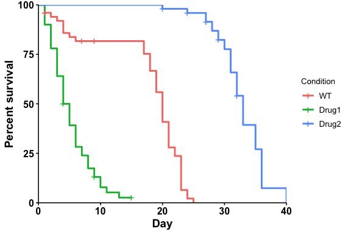
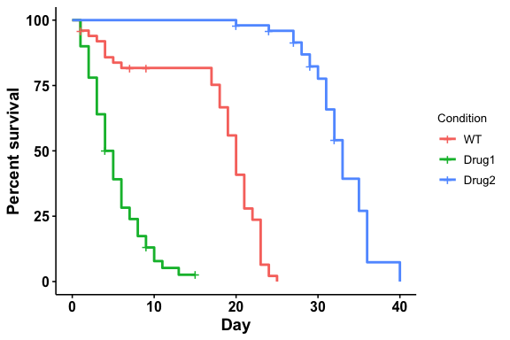
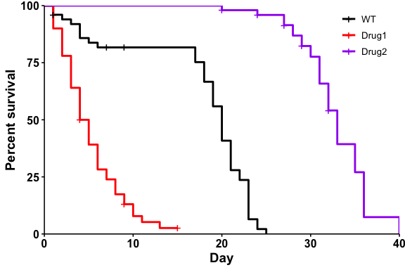
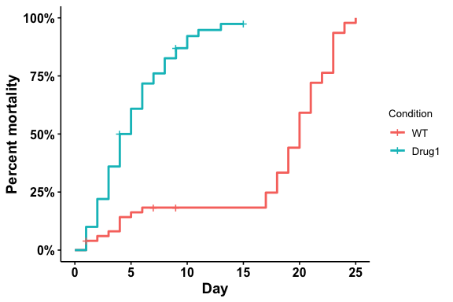

<!-- README.md is generated from README.Rmd. Please edit that file -->

# ggbulksurv

<!-- badges: start -->
<!-- badges: end -->

The`ggbulksurv` package provides functions to easily analyze bulk
survival data from *C.elegans* and *D.melanogaster*.

**What is bulk survival analysis?**

For some model organisms (eg *C. elegans* and *D. melanogaster*),
lifespan studies are usually performed in bulk. In bulk survival
analysis, researchers place a certain number of organisms in a vial, and
count the number of organisms that are dead/censored on any particular
day. This produces a “one row, multiple individuals” data format, which
is not compatible with most R survival packages (eg `survival` and
`survminer`):

| condition | day | dead | censored |
|-----------|-----|------|----------|
| WT        | 10  | 2    | 0        |
| WT        | 12  | 0    | 2        |

…

**What does this package do?**

`ggbulksurv` aims to simplify bulk survival analysis by creating a
default pipeline. In particular, we highlight these two features:

1.  `pivot_prism()` : Easily converts lifespan data into GraphPad PRISM
    compatible formats
2.  `run_bulksurv()` : A one-stop command to plot default survival
    curves and perform statistical analysis.

Advanced users can further customize the functions within the
*ggbulksurv* pipeline.

`ggbulksurv` is very much under **active development**, and any feedback
and contribution are welcome through the Issues page.

**What is R, and how do I get started?**

For complete beginners, see the Getting started with R vignette to
complete setup.

**Do I need this package?**

If you are conducting lifespan studies with *C.elegans* and
*D.melanogaster* - probably.

## Installation

Install the following dependencies from CRAN. If you use the
`tidyverse`, these should already exist:

``` r
install.packages(c("dplyr", "ggplot2", "janitor", "magrittr", "methods", "scales", "tidyr"))
```

Install two other dependencies from Bioconductor:

``` r
if (!require("BiocManager", quietly = TRUE))
    install.packages("BiocManager")
BiocManager::install(c("survival", "survminer"))
```

You can install the development version of `ggbulksurv` from
[GitHub](https://github.com/) with:

``` r
if (!require("devtools", quietly = TRUE))
    install.packages("devtools")
devtools::install_github("qhuitan/ggbulksurv")
```

## Getting started (quick)

### 1. Read in your data with `read.csv()`.

Your data file should be a `csv` with 4 columns: `condition`, `day`,
`dead`, `censored`. Additional columns will be removed from the
analysis.

``` r
library(ggbulksurv)
library(survival)
library(survminer)
#> Loading required package: ggplot2
#> Loading required package: ggpubr
#> 
#> Attaching package: 'survminer'
#> The following object is masked from 'package:survival':
#> 
#>     myeloma
```

Read in your `.csv` file with the following line of code:

    dat <- read.csv("your-csv-file.csv")

For the purposes of this tutorial, I’ve created a ficitonal sample
dataset, `sample_data`, that we will use to illustrate the functions in
this package.

``` r
data(sample_data)
dat <- sample_data # load sample data

head(dat)
#>   condition day dead censored
#> 1        WT   0    0        0
#> 2        WT   1    2        1
#> 3        WT   2    1        0
#> 4        WT   3    1        0
#> 5        WT   4    3        0
#> 6        WT   5    1        0
```

### 2. Run the survival analysis:

`ggbulksurv` can be run with the default settings using the
`run_bulksurv()` command.

Plotting a survival curve:

``` r
# Plot a survival curve
p <- run_bulksurv(dat, 
                  sample_order = c("WT", "Drug1", "Drug2"), 
                  type = "survival")
#> $median_survival
#> Call: survfit(formula = Surv(day, status) ~ condition, data = df_isurv)
#> 
#>                  n events median 0.95LCL 0.95UCL
#> condition=WT    50     47   20.0      19      21
#> condition=Drug1 50     46    4.5       4       6
#> condition=Drug2 50     42   33.0      32      35
#> 
#> $logrank
#> Call:
#> survival::survdiff(formula = Surv(day, status) ~ condition, data = df_isurv)
#> 
#>                  N Observed Expected (O-E)^2/E (O-E)^2/V
#> condition=WT    50       47     31.2      7.94      12.9
#> condition=Drug1 50       46     12.5     89.99     128.1
#> condition=Drug2 50       42     91.3     26.60     123.3
#> 
#>  Chisq= 186  on 2 degrees of freedom, p= <2e-16 
#> 
#> $pairwise
#> 
#>  Pairwise comparisons using Log-Rank test 
#> 
#> data:  df_isurv and condition 
#> 
#>       WT      Drug1  
#> Drug1 2.3e-14 -      
#> Drug2 < 2e-16 < 2e-16
#> 
#> P value adjustment method: BH
```

<!-- -->

Plotting a mortality curve:

``` r
# Plot a mortality curve
p <- run_bulksurv(dat, 
                  sample_order = c("WT", "Drug1", "Drug2"), 
                  type = "mortality",
                  print_stats = FALSE # don't print stats
                  )
```

<!-- -->

## Further customizations

### Changing the p-adjust method

If needed, we can change the p.adjust method. `run_bulksurv()` accepts
the following corrections: “holm”, “hochberg”, “hommel”, “bonferroni”,
“BH”, “BY”, “fdr”, “none”. Default: “BH”

``` r
p <- run_bulksurv(dat, 
                  sample_order = c("WT", "Drug1", "Drug2"), 
                  type = "survival",
                  p_adjust_method = "bonferroni" # use bonferroni correction
                  )
#> $median_survival
#> Call: survfit(formula = Surv(day, status) ~ condition, data = df_isurv)
#> 
#>                  n events median 0.95LCL 0.95UCL
#> condition=WT    50     47   20.0      19      21
#> condition=Drug1 50     46    4.5       4       6
#> condition=Drug2 50     42   33.0      32      35
#> 
#> $logrank
#> Call:
#> survival::survdiff(formula = Surv(day, status) ~ condition, data = df_isurv)
#> 
#>                  N Observed Expected (O-E)^2/E (O-E)^2/V
#> condition=WT    50       47     31.2      7.94      12.9
#> condition=Drug1 50       46     12.5     89.99     128.1
#> condition=Drug2 50       42     91.3     26.60     123.3
#> 
#>  Chisq= 186  on 2 degrees of freedom, p= <2e-16 
#> 
#> $pairwise
#> 
#>  Pairwise comparisons using Log-Rank test 
#> 
#> data:  df_isurv and condition 
#> 
#>       WT      Drug1  
#> Drug1 6.9e-14 -      
#> Drug2 < 2e-16 < 2e-16
#> 
#> P value adjustment method: bonferroni
```

<!-- -->

### Changing colors

``` r
p <- run_bulksurv(dat, 
                  sample_order = c("WT", "Drug1", "Drug2"),
                  print_stats = FALSE,                   # don't print stats
                  palette = c("black", "red", "purple"), # Custom colors
                  legend.title = "",                     # Remove legend title
                  legend.position = c(0.9, 0.9),         # Position legend at top right
                  add.pval = TRUE                        # Add pvalue
             )
```

<!-- -->

## Subsetting data

What if you’re only interested in two conditions (eg WT vs Drug1)?

``` r
# Plot
p_filt <- run_bulksurv(dat, 
                  sample_order = c("WT", "Drug1"), # specify conditions of interest
                  print_stats = FALSE # don't print stats
                  )
```

<!-- -->

## Interfacing with PRISM

To allow bulk survival data to be quickly converted to a
PRISM-compatible format, use the `pivot_prism` function:

``` r
head(dat)
#>   condition day dead censored
#> 1        WT   0    0        0
#> 2        WT   1    2        1
#> 3        WT   2    1        0
#> 4        WT   3    1        0
#> 5        WT   4    3        0
#> 6        WT   5    1        0
```

``` r
df_prism <- pivot_prism(dat)

head(df_prism) # A quick look
#> # A tibble: 6 × 4
#>   day   Drug1    WT Drug2
#>   <chr> <dbl> <dbl> <dbl>
#> 1 1         1     1    NA
#> 2 1         1     1    NA
#> 3 1         1     0    NA
#> 4 1         1    NA    NA
#> 5 1         1    NA    NA
#> 6 2         1     1    NA
```

``` r
# Export to csv
write.csv(df_prism, file = "lifespan_prism.csv")
```

``` r
sessionInfo()
#> R version 4.2.2 (2022-10-31)
#> Platform: aarch64-apple-darwin20 (64-bit)
#> Running under: macOS Ventura 13.1
#> 
#> Matrix products: default
#> BLAS:   /Library/Frameworks/R.framework/Versions/4.2-arm64/Resources/lib/libRblas.0.dylib
#> LAPACK: /Library/Frameworks/R.framework/Versions/4.2-arm64/Resources/lib/libRlapack.dylib
#> 
#> locale:
#> [1] en_US.UTF-8/en_US.UTF-8/en_US.UTF-8/C/en_US.UTF-8/en_US.UTF-8
#> 
#> attached base packages:
#> [1] stats     graphics  grDevices utils     datasets  methods   base     
#> 
#> other attached packages:
#> [1] survminer_0.4.9  ggpubr_0.6.0     ggplot2_3.4.2    survival_3.5-5  
#> [5] ggbulksurv_0.1.0
#> 
#> loaded via a namespace (and not attached):
#>  [1] zoo_1.8-11        tidyselect_1.2.0  xfun_0.37         janitor_2.2.0    
#>  [5] purrr_1.0.1       splines_4.2.2     lattice_0.20-45   carData_3.0-5    
#>  [9] snakecase_0.11.0  colorspace_2.1-0  vctrs_0.6.3       generics_0.1.3   
#> [13] htmltools_0.5.4   yaml_2.3.7        utf8_1.2.3        survMisc_0.5.6   
#> [17] rlang_1.1.1       pillar_1.9.0      withr_2.5.0       glue_1.6.2       
#> [21] lifecycle_1.0.3   plyr_1.8.8        stringr_1.5.0     munsell_0.5.0    
#> [25] ggsignif_0.6.4    gtable_0.3.3      evaluate_0.20     labeling_0.4.2   
#> [29] knitr_1.42        fastmap_1.1.1     fansi_1.0.4       highr_0.10       
#> [33] broom_1.0.3       Rcpp_1.0.11       xtable_1.8-4      scales_1.2.1     
#> [37] backports_1.4.1   abind_1.4-5       farver_2.1.1      km.ci_0.5-6      
#> [41] gridExtra_2.3     digest_0.6.33     stringi_1.7.12    rstatix_0.7.2    
#> [45] dplyr_1.1.3       KMsurv_0.1-5      grid_4.2.2        cli_3.6.1        
#> [49] tools_4.2.2       magrittr_2.0.3    tibble_3.2.1      tidyr_1.3.0      
#> [53] car_3.1-1         pkgconfig_2.0.3   Matrix_1.5-4.1    data.table_1.14.8
#> [57] timechange_0.2.0  lubridate_1.9.1   rmarkdown_2.20    rstudioapi_0.14  
#> [61] R6_2.5.1          compiler_4.2.2
```
