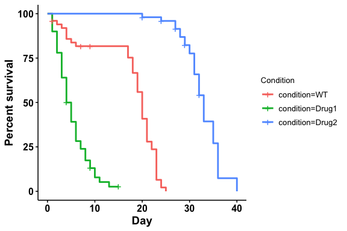
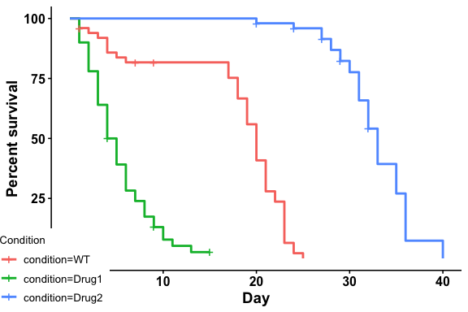
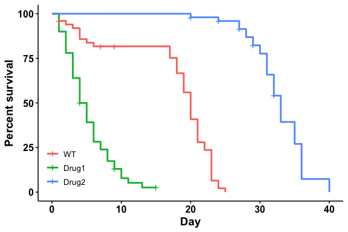
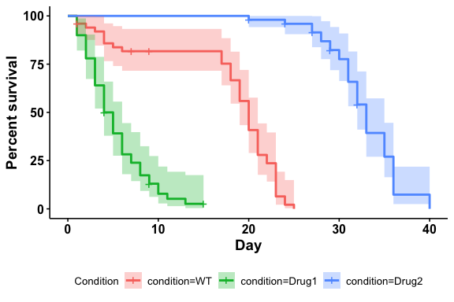
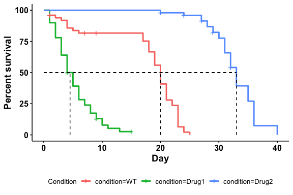
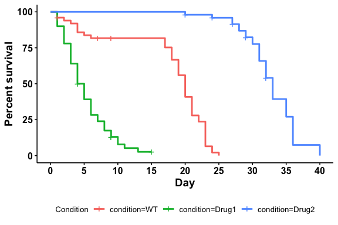
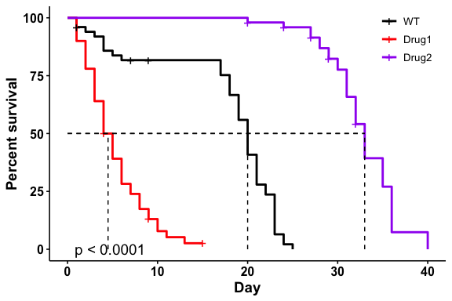
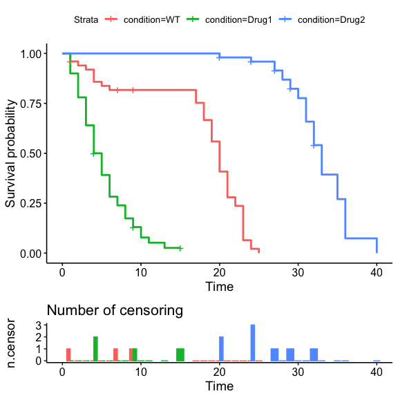

<!-- README.md is generated from README.Rmd. Please edit that file -->

# ggbulksurv

<!-- badges: start -->
<!-- badges: end -->

The`ggbulksurv` package provides functions to facilitate bulk survival
analysis, allowing users to input multiple observations per row.

**What is bulk survival analysis?**

For some model organisms (eg *C. elegans* and *D. melanogaster*),
lifespan studies are usually performed in bulk. In bulk survival
analysis, researchers place a certain number of organisms in a vial, and
count the number of organisms that are dead/censored on any particular
day. This produces a table that looks like this, with multiple
observations per row:

| condition | day | dead | censored |
|-----------|-----|------|----------|
| WT        | 10  | 2    | 0        |
| WT        | 12  | 0    | 2        |

…

Unsurprisingly, survival analysis packages in R (eg `survival`,
`survminer`) require each row to correspond to one individual. Wrangling
the data manually is often a rather tedious task.

**What does this package do?**

`ggbulksurv` converts bulk survival data into individual observations
per row, and plots a survival curve. Other functions are also available
to plot mortality curves, customize colors, and to calculate relevant
statistics such as median survival and log-rank tests.

`ggbulksurv` is very much under **active development**, and any feedback
and contribution are welcome through the Issues page.

**Do I need this package?**

If you are conducting lifespan studies with *C.elegans* and
*D.melanogaster* - probably.

## Installation

Install the following dependencies from CRAN. If you use the
`tidyverse`, these should already exist:

``` r
install.packages(c("dplyr", "ggplot2", "janitor", "magrittr", "methods", "scales", "tidyr"))
```

Install two other dependencies from Bioconductor:

``` r
if (!require("BiocManager", quietly = TRUE))
    install.packages("BiocManager")
BiocManager::install(c("survival", "survminer"))
```

You can install the development version of `ggbulksurv` from
[GitHub](https://github.com/) with:

``` r
if (!require("devtools", quietly = TRUE))
    install.packages("devtools")
devtools::install_github("qhuitan/ggbulksurv")
```

## Getting started (quick)

### 1. Read in your data with `read.csv()`.

Your data file should be a `csv` with 4 columns: `condition`, `day`,
`dead`, `censored`. Additional columns will be removed from the
analysis.

``` r
library(ggbulksurv)
library(survival)
library(survminer)
#> Loading required package: ggplot2
#> Loading required package: ggpubr
#> 
#> Attaching package: 'survminer'
#> The following object is masked from 'package:survival':
#> 
#>     myeloma

data(sample_data)
dat <- sample_data # load sample data

# If reading in a csv, use this code
#dat <- read.csv("/path-to-your-file/file.csv")

head(dat)
#>   condition day dead censored
#> 1        WT   0    0        0
#> 2        WT   1    2        1
#> 3        WT   2    1        0
#> 4        WT   3    1        0
#> 5        WT   4    3        0
#> 6        WT   5    1        0
```

### 2. Run the survival analysis:

`ggbulksurv` can be run with the default settings using the
`run_bulksurv()` command.

Plotting a survival curve:

``` r
# Plot a survival curve
p <- run_bulksurv(dat, 
                  sample_order = c("WT", "Drug1", "Drug2"), 
                  type = "survival")
#> $median_survival
#> Call: survfit(formula = Surv(day, status) ~ condition, data = df_isurv)
#> 
#>                  n events median 0.95LCL 0.95UCL
#> condition=WT    50     47   20.0      19      21
#> condition=Drug1 50     46    4.5       4       6
#> condition=Drug2 50     42   33.0      32      35
#> 
#> $logrank
#> Call:
#> survival::survdiff(formula = Surv(day, status) ~ condition, data = df_isurv)
#> 
#>                  N Observed Expected (O-E)^2/E (O-E)^2/V
#> condition=WT    50       47     31.2      7.94      12.9
#> condition=Drug1 50       46     12.5     89.99     128.1
#> condition=Drug2 50       42     91.3     26.60     123.3
#> 
#>  Chisq= 186  on 2 degrees of freedom, p= <2e-16 
#> 
#> $pairwise
#> 
#>  Pairwise comparisons using Log-Rank test 
#> 
#> data:  df_isurv and condition 
#> 
#>       WT      Drug1  
#> Drug1 2.3e-14 -      
#> Drug2 < 2e-16 < 2e-16
#> 
#> P value adjustment method: BH

p
```

<!-- -->

Plotting a mortality curve:

``` r
# Plot a mortality curve
p <- run_bulksurv(dat, 
                  sample_order = c("WT", "Drug1", "Drug2"), 
                  type = "mortality",
                  print_stats = FALSE # don't print stats
                  )
#> Scale for y is already present.
#> Adding another scale for y, which will replace the existing scale.

p
```

<!-- -->

### Additional customizations

``` r
p <- run_bulksurv(dat, 
                  sample_order = c("WT", "Drug1", "Drug2"),
                  print_stats = FALSE,                   # don't print stats
                  palette = c("black", "red", "purple"), # Custom colors
                  legend.title = "",                     # Remove legend title
                  legend.position = c(0.9, 0.9),         # Position legend at top right
                  add.pval = TRUE                        # Add pvalue
             )

p
```

<!-- -->

## Getting started (slower)

The `run_bulksurv()` command makes several choices for the user, with
the caveat that these assumptions tend to hold under most conditions.
Users who desire total control over the process should read this section
for a more detailed walkthrough.

`run_bulksurv()` is a wrapper around the 3 following functions:

1.  `get_indiv_surv`: Converts a bulk survival table into an individual
    survival table.
2.  `fit_surv`: Fits a survival object from `survival::survfit()`.
3.  `plot_surv`: Plots a survival curve using `survminer::ggsurvplot()`.

This section takes you through the 3 steps that `run_bulksurv()` wraps
around.

### 1. Get individual survivals

`get_indiv_surv` converts a table of bulk survival data into individual
survivals. Each row now represents an individual. `day` represents the
number of days lived, while `status` is either 0 (censored) or 1 (dead).

``` r
df_isurv <- get_indiv_surv(sample_data,
                           sample_order = c("WT", "Drug1", "Drug2"))

head(df_isurv)
#> # A tibble: 6 × 3
#>   condition   day status
#>   <fct>     <int>  <dbl>
#> 1 WT            1      0
#> 2 WT            1      1
#> 3 WT            1      1
#> 4 Drug1         1      1
#> 5 Drug1         1      1
#> 6 Drug1         1      1
```

We now have a `tibble` with one individual per row.

### 2. Fit the survival object

`fit_surv` creates a `survfit` object for `day` and `status`, then fits
a survival curve by `condition`. It takes in a `data.frame` with one
individual per row, and creates a `survfit` object using the
`survival::survfit()` function.

``` r
# Fit survival object
df_fit <- fit_surv(df_isurv)

head(df_fit)
#> Call: survfit(formula = Surv(day, status) ~ condition, data = df_isurv)
#> 
#>                  n events median 0.95LCL 0.95UCL
#> condition=WT    50     47   20.0      19      21
#> condition=Drug1 50     46    4.5       4       6
#> condition=Drug2 50     42   33.0      32      35
```

Drug1 has the shortest median lifespan of 4.5 days, with a 95%
confidence interval (95% CI) of 4 to 6 days. In contrast, Drug2 has the
longest median lifespan of 33 days, with a 95% CI of 32 to 35 days.

### 3. Plot the survival object

`plot_surv` is a wrapper around \[survminer::ggsurvplot()\]. As such,
all additional arguments passed to `plot_surv` will be passed to
`survminer::ggsurvplot()`. Some useful examples are illustrated below:

``` r
df_isurv <- get_indiv_surv(sample_data,
                           sample_order = c("WT", "Drug1", "Drug2"))

plot_surv(fit = df_fit, 
          type = "survival",
          data = df_isurv)
```

<!-- -->

#### Changing legend positions

Specifying a position (`right`, `left`, `bottom` or `top`) with
`legend.position`:

``` r
plot_surv(df_fit, 
          type = "survival", 
          data = df_isurv,
          sample_order = c("WT", "Drug1", "Drug2"),
          print_stats = FALSE,
          legend.position = "right" # Change legend position
          )
```

<!-- -->

Specific coordinates can also be used. For bottom left, use
`legend.position = c(0,0)`; for top right, use
`legend.position = c(1,1)`.

``` r
plot_surv(df_fit, 
          type = "survival", 
          sample_order = c("WT", "Drug1", "Drug2"),
          print_stats = FALSE,
          data = df_isurv,
          legend.position = c(0,0) # Specify coordinates
          )
```

<!-- -->

It doesn’t fit - in fact, the legend is partially obscuring our x and y
axes.

We can simplify the legend by removing the legend title and the trailing
`condition=` symbol:

``` r
sample_order = c("WT", "Drug1", "Drug2")

plot_surv(df_fit, 
          type = "survival", 
          sample_order = sample_order,
          data = df_isurv,
          print_stats = FALSE,
          legend.position = c(0.09,0.2), # Specify coordinates
          legend.title = "", # Remove legend title
          legend.labs = sample_order # Remove `condition=`
          )
```

<!-- -->

#### Adding confidence intervals and median survival

``` r
plot_surv(df_fit, 
          data = df_isurv,
          type = "survival",
          add.conf.int = TRUE, # Add 95% confidence interval
          legend.position = "bottom")
```

<!-- -->

``` r
plot_surv(df_fit, 
          data = df_isurv,
          type = "survival",
          add.median.survival = TRUE, # Add median survival line
          legend.position = "bottom")
```

<!-- -->

#### Customizing x-axis day breaks

``` r
plot_surv(df_fit, 
          data = df_isurv,
          type = "survival",
          legend.position = "bottom",
          break.x.by = 5 # Breaks every 5 days
          )
```

<!-- -->

Putting it all together:

``` r
sample_order = c("WT", "Drug1", "Drug2")

plot_surv(df_fit, 
          data = df_isurv,
          type = "survival",
          sample_order = sample_order,
          legend.labs = sample_order,            # Rename legend
          print_stats = FALSE,                   # don't print stats
          palette = c("black", "red", "purple"), # Custom colors
          legend.title = "",                     # Remove legend title
          legend.position = c(0.9, 0.9),         # Position legend at top right
          add.pval = TRUE,                        # Add pvalue
          add.median.survival = TRUE             # Add 50% median line
             )
```

<!-- -->

Alternatively, you can construct your own plots using
`survminer::ggsurvplot`:

``` r
survminer::ggsurvplot(fit = df_fit,
                      data = df_isurv,
                      ncensor.plot = TRUE)
```

<!-- -->

### 4. Print summary statistics

Calculates median survival, logrank test and pairwise logrank test with
BH correction:

``` r
stats <- summary_stats(df_isurv, type = "all")

stats
#> $median_survival
#> Call: survfit(formula = Surv(day, status) ~ condition, data = df_isurv)
#> 
#>                  n events median 0.95LCL 0.95UCL
#> condition=WT    50     47   20.0      19      21
#> condition=Drug1 50     46    4.5       4       6
#> condition=Drug2 50     42   33.0      32      35
#> 
#> $logrank
#> Call:
#> survival::survdiff(formula = Surv(day, status) ~ condition, data = df_isurv)
#> 
#>                  N Observed Expected (O-E)^2/E (O-E)^2/V
#> condition=WT    50       47     31.2      7.94      12.9
#> condition=Drug1 50       46     12.5     89.99     128.1
#> condition=Drug2 50       42     91.3     26.60     123.3
#> 
#>  Chisq= 186  on 2 degrees of freedom, p= <2e-16 
#> 
#> $pairwise
#> 
#>  Pairwise comparisons using Log-Rank test 
#> 
#> data:  df_isurv and condition 
#> 
#>       WT      Drug1  
#> Drug1 2.3e-14 -      
#> Drug2 < 2e-16 < 2e-16
#> 
#> P value adjustment method: BH
```

This returns a `list` object, which allows us to individually pull out
the values of interest. For example:

#### The logrank test:

``` r
stats$logrank
#> Call:
#> survival::survdiff(formula = Surv(day, status) ~ condition, data = df_isurv)
#> 
#>                  N Observed Expected (O-E)^2/E (O-E)^2/V
#> condition=WT    50       47     31.2      7.94      12.9
#> condition=Drug1 50       46     12.5     89.99     128.1
#> condition=Drug2 50       42     91.3     26.60     123.3
#> 
#>  Chisq= 186  on 2 degrees of freedom, p= <2e-16
```

``` r
# chisq value of logrank test
stats$logrank$chisq
#> [1] 186.0854
```

``` r
# pvalue of logrank test
stats$logrank$pvalue
#> [1] 3.909058e-41
```

#### Pairwise log-rank test:

``` r
stats$pairwise
#> 
#>  Pairwise comparisons using Log-Rank test 
#> 
#> data:  df_isurv and condition 
#> 
#>       WT      Drug1  
#> Drug1 2.3e-14 -      
#> Drug2 < 2e-16 < 2e-16
#> 
#> P value adjustment method: BH
```

``` r
# p-values
stats$pairwise$p.value
#>                 WT       Drug1
#> Drug1 2.291558e-14          NA
#> Drug2 3.367080e-24 3.36708e-24
```

To use a different p-value adjustment method, call
`survminer::pairwise_survdiff()`. For example, to use the Bonferroni
correction method, use this code:

``` r
test = survminer::pairwise_survdiff(
  formula = survival::Surv(day, status) ~ condition, # Fit a survival object
  data = df_isurv,
  p.adjust.method = "bonferroni" # Use bonferroni correction
  )

test
#> 
#>  Pairwise comparisons using Log-Rank test 
#> 
#> data:  df_isurv and condition 
#> 
#>       WT      Drug1  
#> Drug1 6.9e-14 -      
#> Drug2 < 2e-16 < 2e-16
#> 
#> P value adjustment method: bonferroni
```

``` r
# obtain specific p-values
test$p.value
#>                 WT       Drug1
#> Drug1 6.874675e-14          NA
#> Drug2 5.465280e-24 6.73416e-24
```

``` r
sessionInfo()
#> R version 4.2.2 (2022-10-31)
#> Platform: aarch64-apple-darwin20 (64-bit)
#> Running under: macOS Ventura 13.1
#> 
#> Matrix products: default
#> BLAS:   /Library/Frameworks/R.framework/Versions/4.2-arm64/Resources/lib/libRblas.0.dylib
#> LAPACK: /Library/Frameworks/R.framework/Versions/4.2-arm64/Resources/lib/libRlapack.dylib
#> 
#> locale:
#> [1] en_US.UTF-8/en_US.UTF-8/en_US.UTF-8/C/en_US.UTF-8/en_US.UTF-8
#> 
#> attached base packages:
#> [1] stats     graphics  grDevices utils     datasets  methods   base     
#> 
#> other attached packages:
#> [1] survminer_0.4.9       ggpubr_0.6.0          ggplot2_3.4.2        
#> [4] survival_3.5-5        ggbulksurv_0.0.0.9000
#> 
#> loaded via a namespace (and not attached):
#>  [1] zoo_1.8-11        tidyselect_1.2.0  xfun_0.37         janitor_2.2.0    
#>  [5] purrr_1.0.1       splines_4.2.2     lattice_0.20-45   carData_3.0-5    
#>  [9] snakecase_0.11.0  colorspace_2.1-0  vctrs_0.6.3       generics_0.1.3   
#> [13] htmltools_0.5.4   yaml_2.3.7        utf8_1.2.3        survMisc_0.5.6   
#> [17] rlang_1.1.1       pillar_1.9.0      withr_2.5.0       glue_1.6.2       
#> [21] lifecycle_1.0.3   stringr_1.5.0     munsell_0.5.0     ggsignif_0.6.4   
#> [25] gtable_0.3.3      evaluate_0.20     labeling_0.4.2    knitr_1.42       
#> [29] fastmap_1.1.1     fansi_1.0.4       highr_0.10        broom_1.0.3      
#> [33] xtable_1.8-4      scales_1.2.1      backports_1.4.1   abind_1.4-5      
#> [37] farver_2.1.1      km.ci_0.5-6       gridExtra_2.3     digest_0.6.33    
#> [41] stringi_1.7.12    rstatix_0.7.2     dplyr_1.1.2       KMsurv_0.1-5     
#> [45] grid_4.2.2        cli_3.6.1         tools_4.2.2       magrittr_2.0.3   
#> [49] tibble_3.2.1      tidyr_1.3.0       car_3.1-1         pkgconfig_2.0.3  
#> [53] Matrix_1.5-4.1    data.table_1.14.8 timechange_0.2.0  lubridate_1.9.1  
#> [57] rmarkdown_2.20    rstudioapi_0.14   R6_2.5.1          compiler_4.2.2
```
