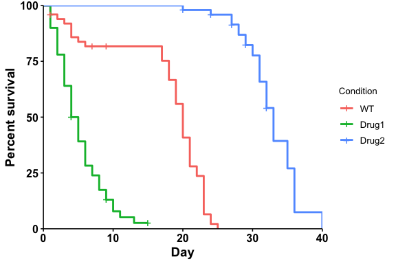

<!-- README.md is generated from README.Rmd. Please edit that file -->

# ggbulksurv

<!-- badges: start -->
<!-- badges: end -->

**What does this package do?**

`ggbulksurv` aims to simplify survival analysis for *C.elegans* and
*D.melanogaster* by creating a user-friendly pipeline. Lifespan data for
these organisms typically look like this, which is incompatible with
current packages:

| condition | day | dead | censored |
|-----------|-----|------|----------|
| WT        | 10  | 4    | 2        |
| Drug1     | 10  | 9    | 0        |
| …         | …   | …    | ….       |

In particular, we highlight these two features:

1.  [Convert lifespan data for GraphPad
    PRISM](https://qhuitan.github.io/ggbulksurv/articles/convert-prism.html):
    Easily convert lifespan data into GraphPad PRISM compatible formats
    with the `pivot_prism()` function.

2.  [Easily customized survival curves in
    R](https://qhuitan.github.io/ggbulksurv/articles/customizing-plot.html):
    Use the `run_bulksurv()` command for a default analysis (plot +
    stats). Customizations: subsetting data, changing colors, changing
    p-value adjustment methods, etc.

`ggbulksurv` is very much under **active development**, and any feedback
and contributions are welcome through the
[Issues](https://github.com/qhuitan/ggbulksurv/issues) page.

**Do I need this package?**

If you are conducting lifespan studies with *C.elegans* and
*D.melanogaster* - probably.

## Installation

Install the following dependencies from CRAN. If you use the
`tidyverse`, these should already exist:

``` r
install.packages(c("dplyr", "ggplot2", "janitor", "magrittr", "scales", "tidyr"))
```

Install two other dependencies from Bioconductor:

``` r
if (!require("BiocManager", quietly = TRUE))
    install.packages("BiocManager")
BiocManager::install(c("survival", "survminer"))
```

You can install the development version of `ggbulksurv` from
[GitHub](https://github.com/) with:

``` r
install.packages("devtools")
```

- For Mac users: If the above code gives an error, install Xcode. The
  easiest way to do this is via [Homebrew](https://brew.sh), a
  convenient package manager which automatically installs Xcode.

``` r
devtools::install_github("qhuitan/ggbulksurv")
```

## Converting data for PRISM

``` r
library(ggbulksurv) # load library
```

`pivot_prism()` converts bulk survival data into a GraphPad
PRISM-compatible format. Your input data file should be a `csv` with 4
columns: `condition`, `day`, `dead`, `censored`. Additional columns will
be removed from the analysis.

``` r
data(sample_data)
dat <- sample_data # load fictional sample data
# Read in your data. Remove the # in front of the following line and replace the filename with your actual file
# dat <- read.csv("your-csv-file.csv")
```

``` r
df_prism <- pivot_prism(dat)

head(df_prism) # A quick look
#> # A tibble: 6 × 4
#>   day   Drug1    WT Drug2
#>   <chr> <dbl> <dbl> <dbl>
#> 1 1         1     1    NA
#> 2 1         1     1    NA
#> 3 1         1     0    NA
#> 4 1         1    NA    NA
#> 5 1         1    NA    NA
#> 6 2         1     1    NA
```

``` r
# Export to csv
write.csv(df_prism, file = "lifespan_prism.csv")
```

## ggbulksurv (R)

### 1. Read in your data with `read.csv()`.

Your data file should be a `csv` with 4 columns: `condition`, `day`,
`dead`, `censored`. Additional columns (`sex`, `genotype`, `treatment`
etc) are **allowed** and will be retained in this analysis.

``` r
library(ggbulksurv)
```

Read in your `.csv` file with the following line of code:

``` r
data(sample_data)
dat <- sample_data # load example data

# Read in your data. Remove the # in front of the following line and replace the filename with your actual file
# dat <- read.csv("your-csv-file.csv")
```

### 2. Run the survival analysis:

``` r
# Plot a survival curve
p <- run_bulksurv(dat,
                  print_stats = TRUE # print stats. FALSE by default
                  )
#> Joining with `by = join_by(x, condition, day, sex, status)`
#> call: formula = Surv(day, status) ~ condition
#> call: formula = Surv(day, status) ~ condition
#> $median_survival
#> Call: survfit(formula = Surv(day, status) ~ condition, data = df_isurv)
#> 
#>                  n events median 0.95LCL 0.95UCL
#> condition=WT    50     47   20.0      19      21
#> condition=Drug1 50     46    4.5       4       6
#> condition=Drug2 50     42   33.0      32      35
#> 
#> $logrank
#> Call:
#> survival::survdiff(formula = Surv(day, status) ~ condition, data = df_isurv)
#> 
#>                  N Observed Expected (O-E)^2/E (O-E)^2/V
#> condition=WT    50       47     31.2      7.94      12.9
#> condition=Drug1 50       46     12.5     89.99     128.1
#> condition=Drug2 50       42     91.3     26.60     123.3
#> 
#>  Chisq= 186  on 2 degrees of freedom, p= <2e-16 
#> 
#> $pairwise
#> 
#>  Pairwise comparisons using Log-Rank test 
#> 
#> data:  df_isurv and condition 
#> 
#>       WT      Drug1  
#> Drug1 2.3e-14 -      
#> Drug2 < 2e-16 < 2e-16
#> 
#> P value adjustment method: BH
```

<!-- -->

Plotting a mortality curve:

``` r
# Plot a mortality curve
p <- run_bulksurv(dat,
                  type = "mortality"
                  )
#> Joining with `by = join_by(x, condition, day, sex, status)`
#> call: formula = Surv(day, status) ~ condition
```

<!-- -->

Custom formula:

``` r
p <- run_bulksurv(dat, 
                  # Specify custom survival formula: condition + sex
                  formula = "Surv(day, status) ~ condition + sex", 
                  # Split colors by condition column
                  color = "condition", 
                  # Change linetype by sex column
                  linetype = "sex", 
                  palette = c("red", "blue", "forestgreen"))
#> Joining with `by = join_by(x, condition, day, sex, status)`
#> call: formula = Surv(day, status) ~ condition + sex
```

<!-- -->
